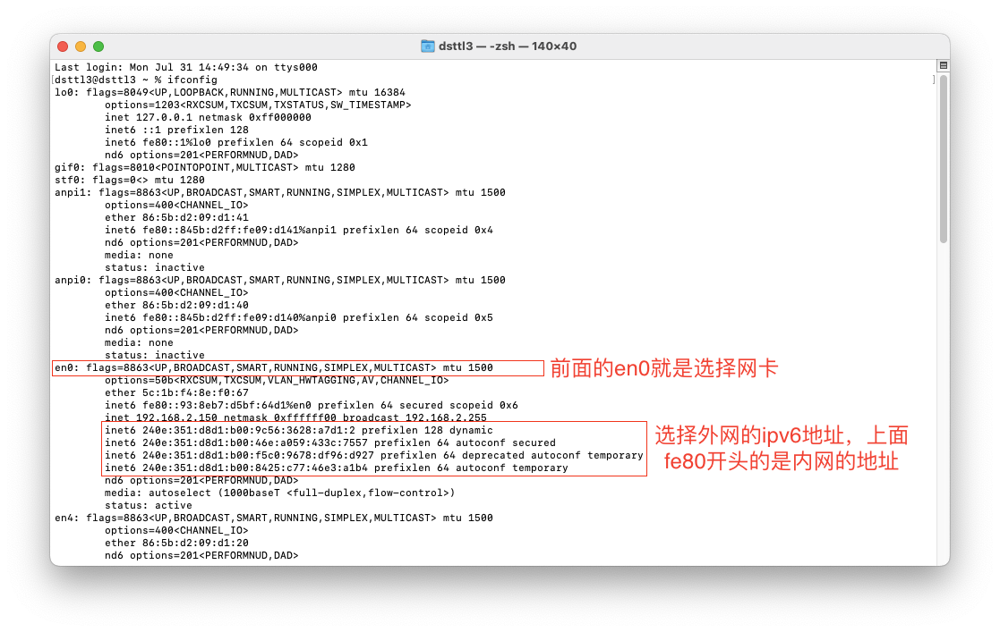

# Ali_DDNS

阿里DDNS
>这是一个基于阿里云提供的API的域名解析服务，旨在帮助用户实现动态的域名解析功能。通过该服务，用户可以获取其当前的公共IP地址，并在IP地址发生变化时，自动更新相关域名的解析记录，确保域名始终与正确的IP地址相匹配。

>This is a domain name resolution service based on the API provided by Alibaba Cloud, designed to assist users in achieving dynamic domain name resolution. Through this service, users can obtain their current public IP address and automatically update the relevant domain name's resolution records whenever the IP address changes, ensuring that the domain always matches the correct IP address.

``` Java
    // 主域名 目前只支持阿里云账号下的域名
    public static String domainName = "l3.pub";
    // 主机记录 二级域名，如www、@、blog等
    public static String domainRR = "www";
    // 解析记录类型 ipv4填写A，ipv4填写AAAA
    public static String domainType = "AAAA";
    // 地域ID 默认就行
    public static String  Region_ID = "cn-qingdao";
    // 填写您的 阿里云 AccessKey ID
    public static String  AccessKey_ID = "******";
    // 填写您的 阿里云 AccessKey Secret
    public static String  AccessKey_Secret = "*****";
    // IPv6地址前缀，用于区分内网地址 按自己IP前缀填写
    public static String prefix = "240e";
    // 网卡标识，用于选择网卡 按自己外网网卡填写
    public static String netCard = "%en0";
```


